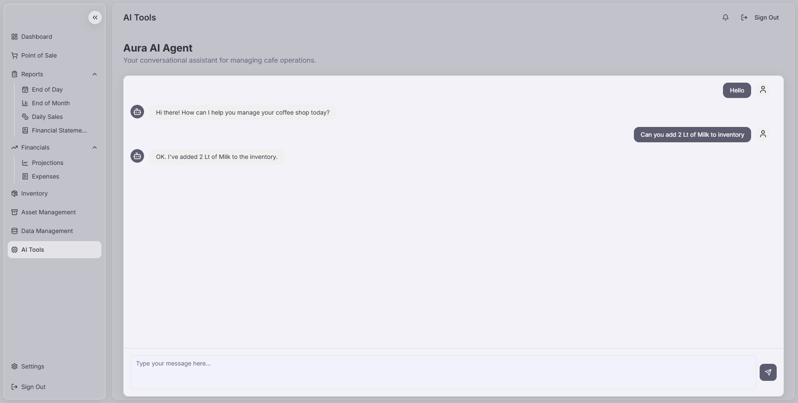
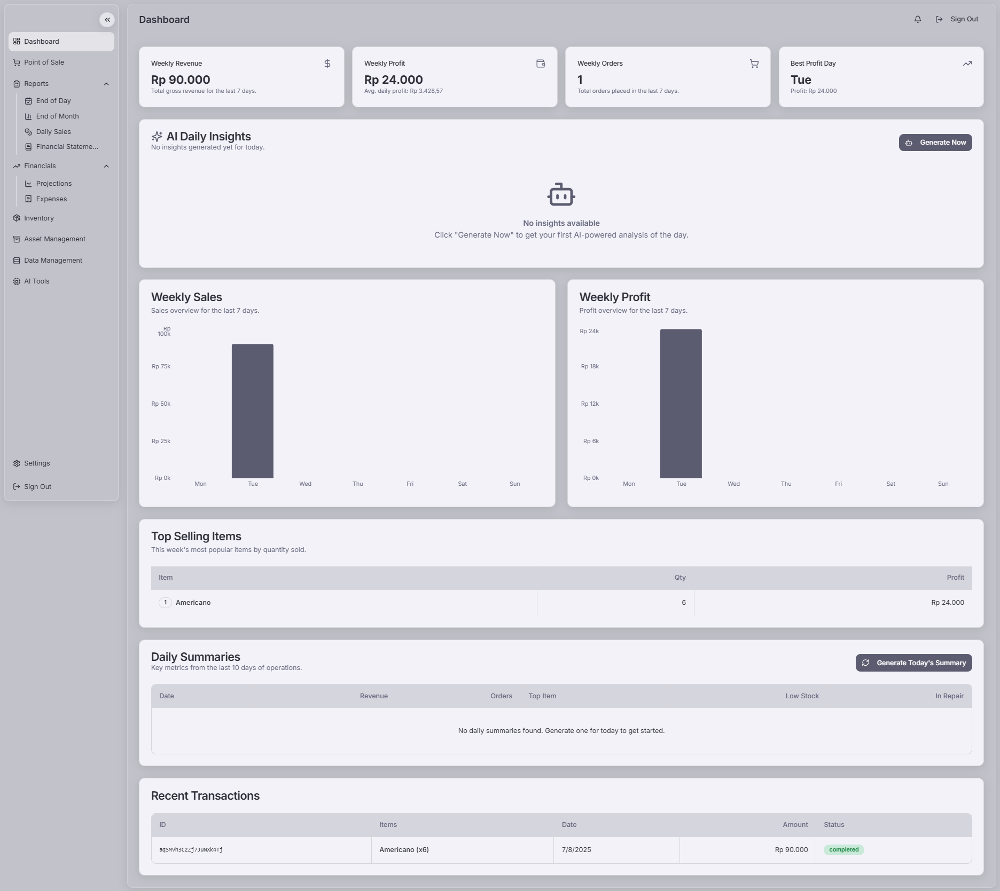
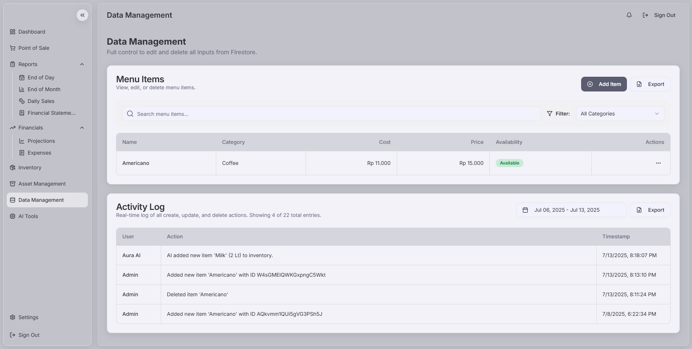
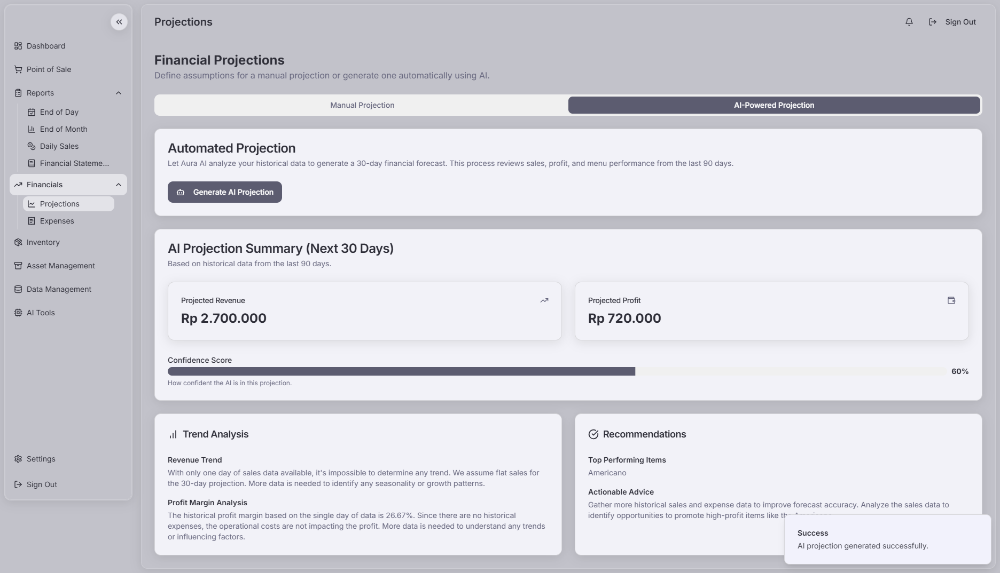
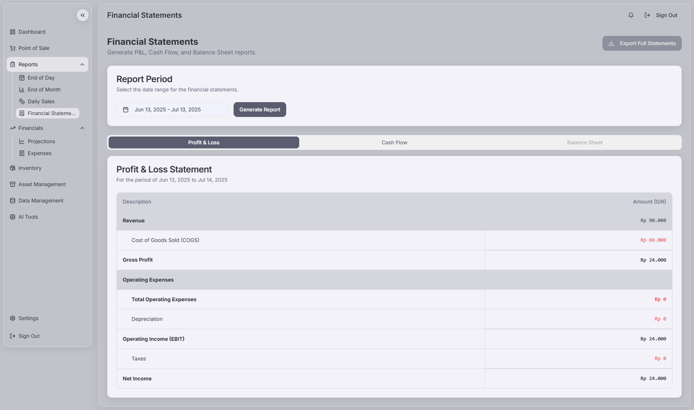

# POS Web App for Cafes

This is a comprehensive Point-of-Sale (POS) web application designed specifically for cafes. It leverages modern web technologies, including Next.js, Firebase, and Google's generative AI (Genkit), to provide a feature-rich, intelligent, and user-friendly solution for cafe management.

## Screenshots

## License

This project is licensed under the MIT License. See the `LICENSE` file for more information.
